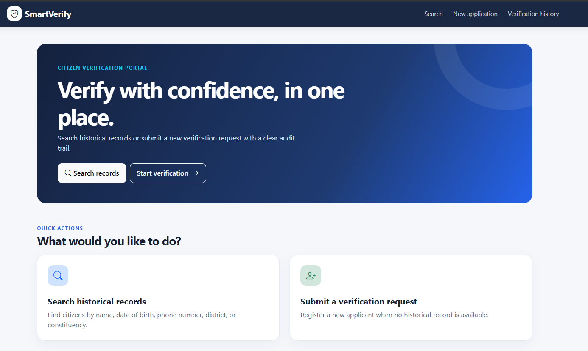
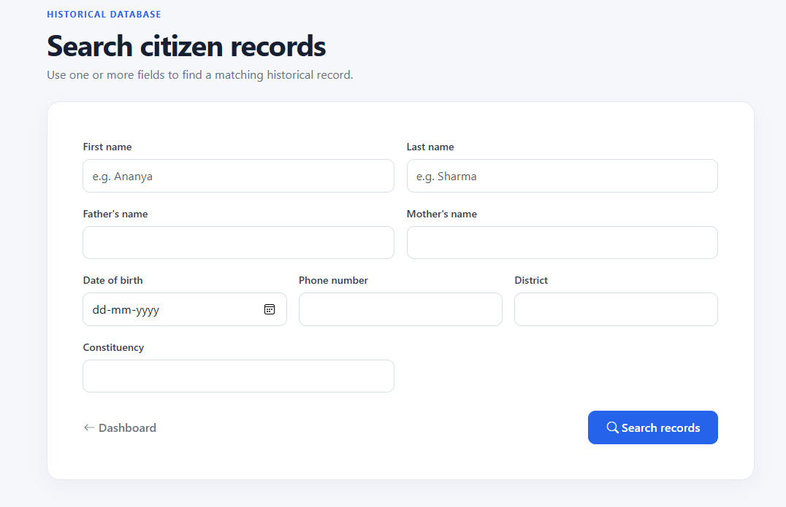
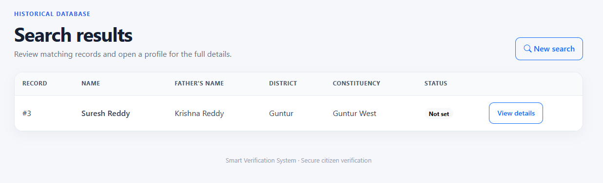
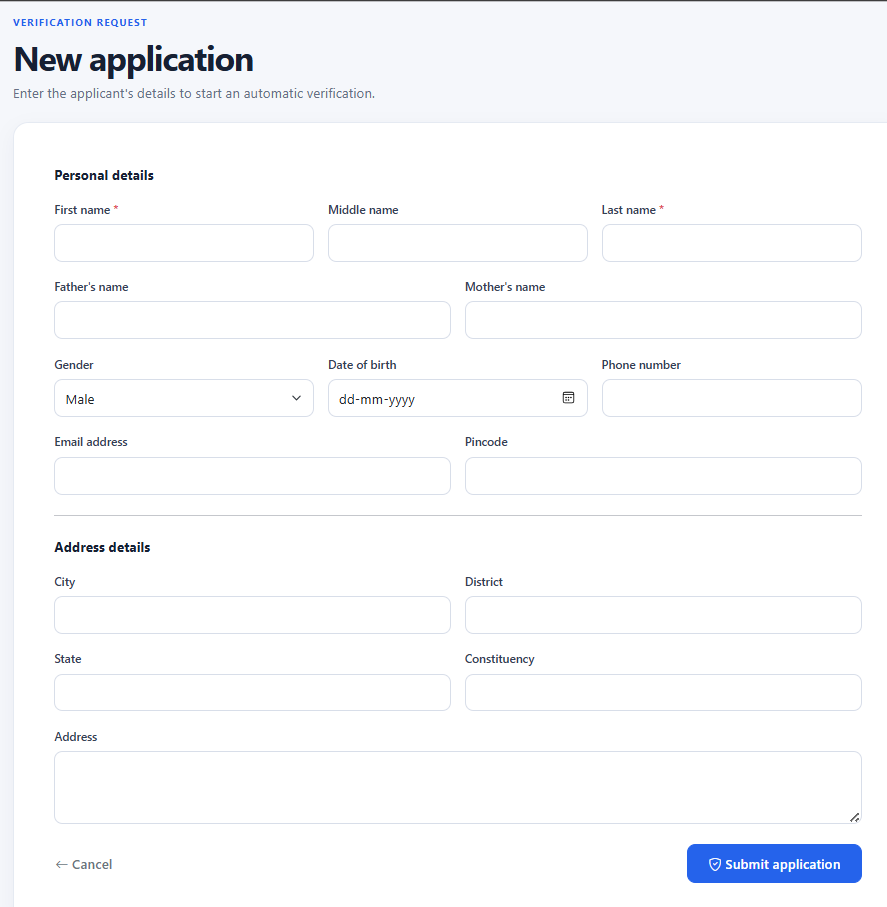
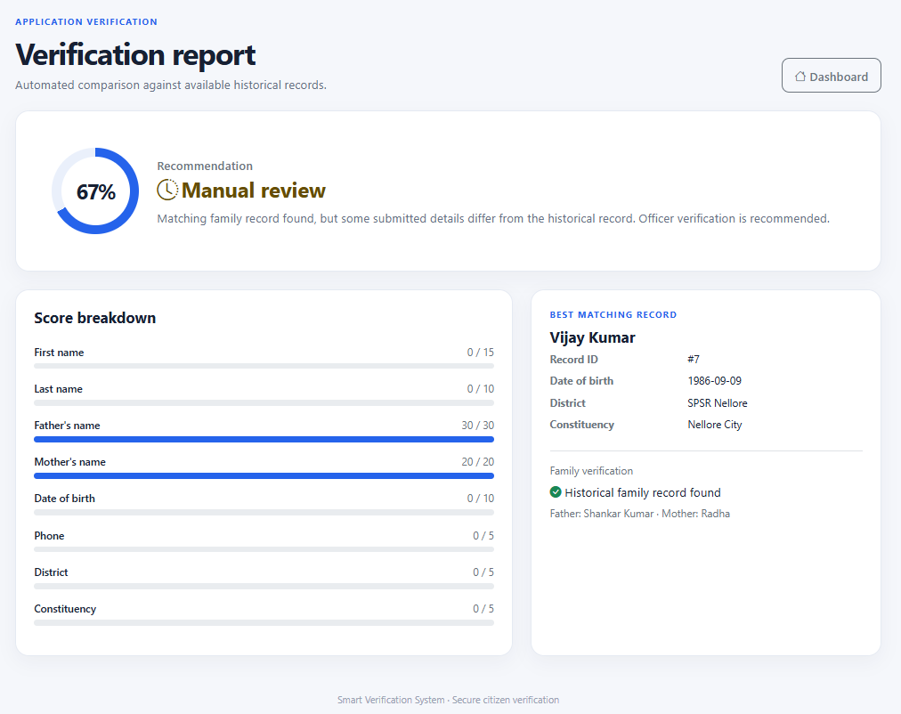
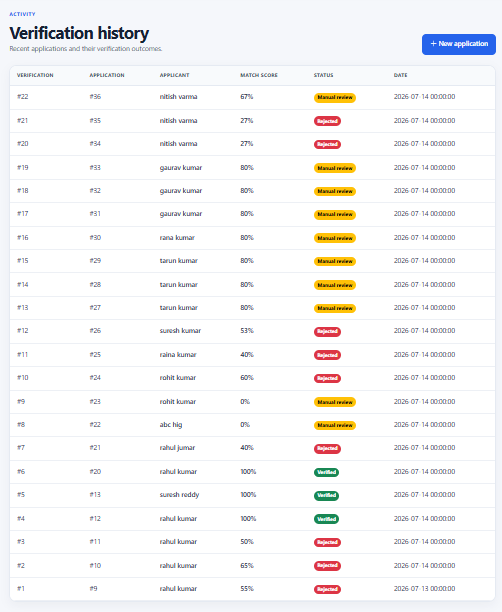

# Citizen Verification System

## 📌 Project Overview

The Citizen Verification System is a Flask and MySQL based web application that simulates a government-style citizen verification portal.

The system verifies newly submitted citizen applications by comparing them with historical government records using a family-based verification algorithm and dynamic scoring.

---

## 🚀 Features

- Historical Record Search
- Citizen Verification Request
- Family-based Verification
- Dynamic Verification Scoring
- Verification Report
- Verification History
- Search Logs
- Government-style Dashboard

---

## 🛠️ Technologies Used

- Python
- Flask
- MySQL
- HTML
- CSS
- Bootstrap
- SQL

---

## 🗄 Database Design

The project consists of 9 relational tables:

- historical_record
- new_application
- verification_result
- family_link
- search_log
- audit_log
- address_history
- duplicate_log
- verification_rules

---

## 🔄 Workflow

1. User submits a Citizen Verification Request.
2. Application is stored in the database.
3. System searches the historical records using the applicant's parents' names.
4. If a family record is found, a dynamic verification score is calculated.
5. The application is categorized as:
   - Verified
   - Manual Review
   - Rejected
6. The verification report is generated and stored for future reference.

---

## 📊 Verification Logic

The verification score is calculated based on matching fields:

| Field | Weight |
|--------|--------|
| Father Name | 30 |
| Mother Name | 20 |
| First Name | 15 |
| Last Name | 10 |
| DOB | 10 |
| Phone | 5 |
| District | 5 |
| Constituency | 5 |

Only the fields provided by the applicant are considered while calculating the final percentage.

---


## 📷 Screenshots

### Dashboard



---

### Historical Record Search



---

### Search Results



---

### Citizen Verification Request



---

### Verification Report



---

### Verification History



---

## 📂 Project Structure

```
Citizen_Verification_System
│
├── app.py
├── db.py
├── verification.py
├── requirements.txt
│
├── templates/
│
├── static/
│
├── database/
│
└── README.md
```

---

## ▶️ How to Run

Clone the repository

```bash
git clone https://github.com/yourusername/citizen-verification-system.git
```

Install dependencies

```bash
pip install -r requirements.txt
```

Run the application

```bash
python app.py
```

Open your browser

```
http://127.0.0.1:5000
```

---

## 🎯 Future Enhancements

- Aadhaar Integration
- Face Recognition
- QR Verification
- Officer Login
- OTP Verification

---

## 👨‍💻 Author

**Varun Sagar**

B.Tech Computer Science Engineering (AI & ML)
